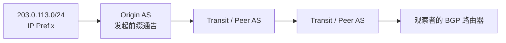
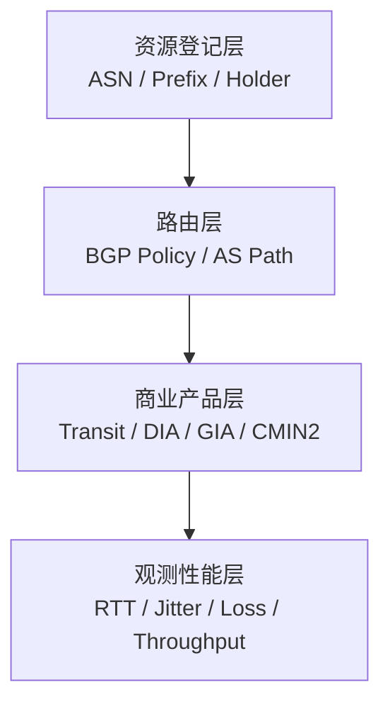
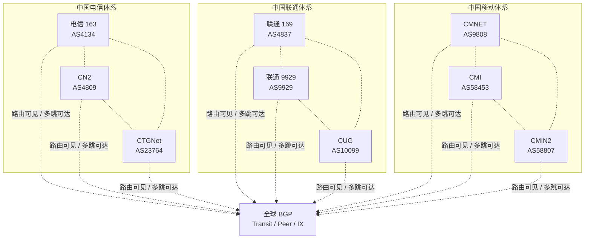
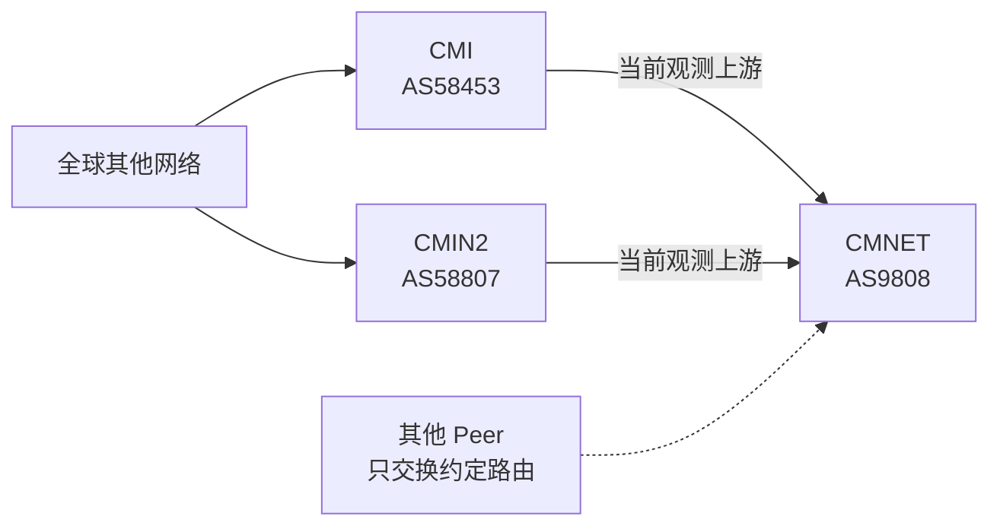
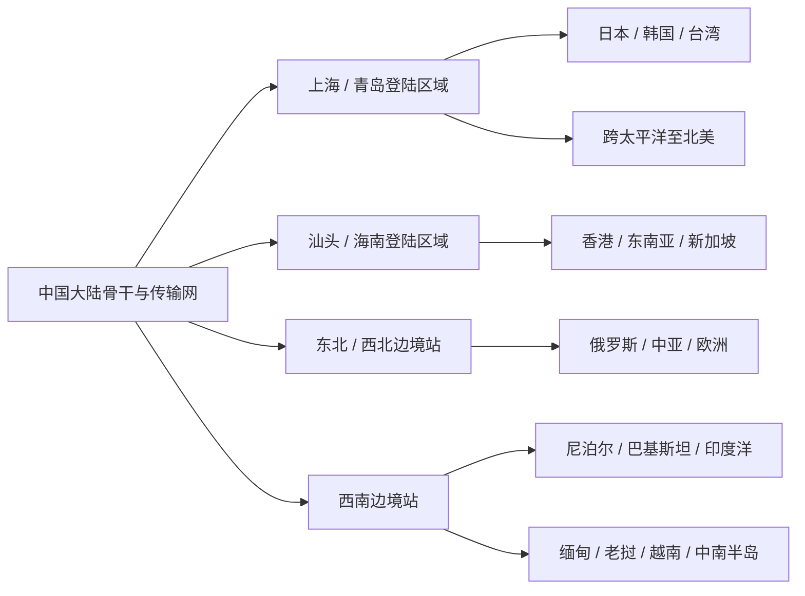
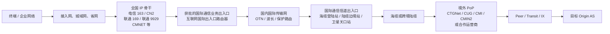

# ASN、骨干网与跨境路由参考

> 面向网络工程、服务器运维和路由排障人员，整理 ASN、BGP、运营商骨干、国际光缆、国际通信出入口、Internet Exchange 及区域网络的公开事实与验证方法。
>
> 更新日期：2026-07-29。本文不做线路购买建议、价格比较或永久性能排名。延迟、丢包、吞吐和实际路径必须作为带时间、方向和探测点的观测记录。

## 1. 文档范围与证据约定

本文回答六类问题：

1. 一个 ASN 登记给谁，代表什么网络角色。
2. 大陆骨干、国际子公司网络和商业产品之间是什么关系。
3. 香港、澳门、台湾、日本、新加坡、韩国、欧洲和北美常见哪些网络与 IX。
4. 中国大陆通过哪些主要海缆、陆缆和登陆/入境点连接境外，公开容量数字应如何理解。
5. 国际通信信道出入口、业务出入口和边境地区出入口分别处于哪一层，公共互联网流量通常怎样出入境。
6. 如何用公开数据和实测区分事实、运营者声明与动态路由观测。

### 1.1 来源标记

| 标记 | 来源 | 能证明什么 | 不能单独证明什么 |
|---|---|---|---|
| `LAW` | 现行法律、行政法规、部门规章和主管部门许可 | 国际联网、出入口设置、运营和数据出境的制度要求 | 某一前缀的实时路由、未公开的设备拓扑和执法实现 |
| `REG` | RIR WHOIS/RDAP，例如 APNIC、ARIN、RIPE NCC | ASN、IP 资源的登记主体、公开名称和维护信息 | 当前路由、互联关系、产品等级和性能 |
| `OP` | 运营商、IX 或产品的官方资料 | 运营者自述的网络角色、产品、PoP、政策或服务范围 | 任意前缀当前采用的路径和实际性能 |
| `OBS` | RIPE RIS、RouteViews、RIPE Atlas、Looking Glass 和本地测量 | 特定时间和观测点看到的控制面或数据面结果 | 未观测方向、未覆盖区域和未来状态 |
| `PDB` | PeeringDB 中由网络或 IX 维护的资料 | 公开的 ASN、互联位置、流量规模和对等策略 | 双方已经建立 Peer、某前缀使用该 Peer 或容量充足 |
| `REF` | 有明确日期的行业文章、历史测试或二手汇总 | 提供待验证的网络名称、路径和区域经验线索 | 当前 Peer/Transit 关系、完整前缀范围、双向路径和长期性能 |

来源优先级不是简单的高低关系，而是用途不同。制度要求以 `LAW` 为准；ASN 主体以 `REG` 为准；商业产品以 `OP` 为准；当前路径以带时间的 `OBS` 为准；互联位置和公开策略可用 `PDB` 辅助确认；`REF` 只能提出核验目标，不能替代观测。

### 1.2 信息时效

| 类型 | 示例 | 文档写法 |
|---|---|---|
| 相对稳定 | ASN 登记主体、RFC 定义 | 直接陈述，并附事实源 |
| 可能调整 | 网络品牌、PoP、IX 参与者、对等政策 | 附查询日期或官方入口，不写成永久状态 |
| 高度动态 | AS Path、进出口城市、延迟、丢包、互联容量 | 只作为带时间、源、目标和方向的观测记录 |

## 2. ASN 与 BGP 基础

### 2.1 AS 与 ASN

自治系统（Autonomous System，AS）是一组在统一管理和路由策略下运行的 IP 网络。ASN 是标识该自治系统的编号。RFC 1930 给出早期选取和使用 ASN 的指导；RFC 6793 定义了四字节 ASN 支持。

- 公网 ASN 由区域互联网注册管理机构分配。
- 同一组织可以运营多个 ASN，每个 ASN 也可能承担不同网络角色。
- 一个商业品牌、一个法人主体和一个 ASN 不是一一对应关系。
- 每个公网 ASN 都可以作为独立路由域建立 eBGP 邻接和发布前缀；它可以通过 Transit、Peering 或 IX 获得全球可达，不需要与全球每个 ASN 直接建立 Peer。
- ASN 的独立性是控制面和路由策略身份上的独立，不代表该 AS 当前一定拥有第三方 Transit、完整全球路由或完全独立的国际出口。
- 实际可达范围取决于运营者配置的邻接、路由导入导出和商业关系；一个独立 AS 完全可能只使用同集团其他 AS 作为上游。
- 私有 ASN 范围由 [RFC 6996](https://www.rfc-editor.org/rfc/rfc6996.html) 定义，不应直接出现在全球 BGP 表中。

基础事实源：[RFC 1930](https://www.rfc-editor.org/rfc/rfc1930.html)、[RFC 6793](https://www.rfc-editor.org/rfc/rfc6793.html)、[APNIC WHOIS](https://wq.apnic.net/)。

### 2.2 前缀、Origin AS 与 AS Path

互联网路由以 IP 前缀为基本对象。BGP UPDATE 中的 `AS_PATH` 记录路由通告经过的 AS 序列。按常见的 `AS_SEQUENCE` 表示，从观察者读取时，左侧 ASN 更接近观察者，右侧 ASN 通常是发起该前缀通告的 Origin AS；聚合、`AS_SET` 和 Confederation 等情况需要单独处理。



需要区分：

- **BGP AS Path** 是控制面传播路径，不是逐跳物理路径。
- **traceroute** 是基于 ICMP/UDP/TCP 回包推断的数据面逐跳结果，不是 BGP 表。
- MPLS、隧道、第三方接口地址、ICMP 限速和回包路径都可能使 traceroute 不完整。
- AS 内部的 IGP、MPLS、QoS、链路容量和流量工程通常不会出现在 AS Path 中。
- 去程和回程由各自网络独立选路，路径不对称是正常现象。

协议事实源：[RFC 4271](https://www.rfc-editor.org/rfc/rfc4271.html)。

### 2.3 Transit、Peering、IX 与 PNI

| 概念 | 定义 | 关键边界 |
|---|---|---|
| IP Transit | 客户向上游购买到全互联网的可达能力 | 购买 Transit 不保证任意目的地走最短路径 |
| Peering | 两个网络交换各自及约定客户前缀的流量 | 有对等关系不等于所有地区、前缀和方向都使用它 |
| IX/IXP | 为多个网络提供二层互联环境的 Internet Exchange | 同处一个 IX 不等于双方已互联；IX 通常不等于 Transit |
| Route Server | IX 内集中交换路由信息的服务 | 经 Route Server 学到路由不等于数据流经过 Route Server |
| PNI | 两个网络之间的 Private Network Interconnect | 私有互联的位置、容量和策略可能不公开 |
| PoP | 运营商部署网络设备并提供接入或互联的 Point of Presence | PoP 是网络节点概念，不等于数据中心品牌或海缆登陆站 |

以 HKIX 为例，其官方政策明确将自身定义为二层、无结算的 Internet Exchange，而不是 Transit Provider。[HKIX 说明（OP）](https://www.hkix.net/hkix/whatishkix.htm)、[HKIX 政策（OP）](https://www.hkix.net/hkix/policies.htm)。

### 2.4 注册、路由、产品与性能是四层信息



四层不能相互替代：

- ASN 登记不能证明商业产品等级。
- AS Path 出现目标 ASN 不能证明带宽、SLA 或 QoS。
- 产品名称不能证明当前去回程路径。
- 单次测速不能定义整个 ASN 或运营商的长期性能。

## 3. 中国大陆主要骨干与国际网络

### 3.1 核心 ASN

| 体系 | ASN | 公开名称 | 大众俗称 | 网络角色 | 事实源 |
|---|---:|---|---|---|---|
| 中国电信 | `AS4134` | `CHINANET-BACKBONE` | **电信 163**、ChinaNet | ChinaNet 公众互联网骨干，具有国际可达和互联能力 | [APNIC（REG）](https://wq.apnic.net/apnic-bin/whois.pl?searchtext=AS4134) |
| 中国电信 | `AS4809` | `CHINATELECOM-CORE-WAN-CN2` | **CN2** | 中国电信下一代承载网络，承担差异化、政企及跨境承载 | [APNIC（REG）](https://wq.apnic.net/apnic-bin/whois.pl?searchtext=AS4809) |
| 中国电信国际 | `AS23764` | `CTGNet` | **CTGNet**、CTG | China Telecom Global 运营的全球网络之一 | [APNIC（REG）](https://wq.apnic.net/apnic-bin/whois.pl?searchtext=AS23764) |
| 中国联通 | `AS4837` | `CHINA169-Backbone` | **联通 169**、China169 | China169 公众互联网骨干 | [APNIC（REG）](https://wq.apnic.net/apnic-bin/whois.pl?searchtext=AS4837) |
| 中国联通 | `AS9929` | `CUII` | **联通 9929**、A 网 | China Unicom Industrial Internet Backbone | [APNIC（REG）](https://wq.apnic.net/apnic-bin/whois.pl?searchtext=AS9929) |
| 中国联通国际 | `AS10099` | `UNICOM-Global` | **CUG**、联通国际 | China Unicom Global 国际网络和网关 | [APNIC（REG）](https://wq.apnic.net/apnic-bin/whois.pl?searchtext=AS10099) |
| 中国移动 | `AS9808` | `CHINAMOBILE-CN` | **CMNET**、移动 9808 | 中国移动大陆公众互联网骨干 | [APNIC（REG）](https://wq.apnic.net/apnic-bin/whois.pl?searchtext=AS9808) |
| 中国移动国际 | `AS58453` | `CMI-INT-HK` | **CMI** | China Mobile International 全球 IP 网络 | [APNIC（REG）](https://wq.apnic.net/apnic-bin/whois.pl?searchtext=AS58453)、[CMI Policy（OP）](https://www.cmi.chinamobile.com/pdf/zaqxwwtgblephes/Peering_Policy_For_External.pdf) |
| 中国移动国际 | `AS58807` | `CMI-INT-AS` | **CMIN2** | CMI 运营的另一张国际网络；官方合同材料将 CMIN2 对应到该 ASN | [APNIC（REG）](https://wq.apnic.net/apnic-bin/whois.pl?searchtext=AS58807)、[CMI SLA（OP）](https://mainwebapi.cmi.chinamobile.com/uploads/template/20251216272c9a10af6d23e3b7c459e04e91bf4b.pdf) |
| 教育网 | `AS4538` | `ERX-CERNET-BKB` | **CERNET**、教育网 | 中国教育和科研计算机网骨干 | [APNIC（REG）](https://wq.apnic.net/apnic-bin/whois.pl?searchtext=AS4538)、[CERNET（OP）](https://cernet.edu.cn/xxh/zt/CERNET30/202405/t20240523_2611789.shtml) |
| 科技网 | `AS7497` | `CSTNET-AS-AP` | **CSTNET**、科技网 | 中国科技网骨干 | [APNIC（REG）](https://wq.apnic.net/apnic-bin/whois.pl?searchtext=AS7497) |

后文优先使用加粗列中的大众俗称，需要精确识别时再附 ASN。电信 163 的“163”不是 `AS163`；CN2 GT、CN2 GIA 是产品或线路称呼，也不等同于 `AS4809` 的 ASN 俗称。

### 3.2 九个 ASN 的独立性与同集团关系

电信、联通、移动各列出的三个 ASN，首先都应理解为**独立自治系统**：

- 各自拥有独立 ASN 标识，可以分别配置 BGP 策略、发布前缀并建立邻接关系。
- 从协议能力看，各自都可以连接 Transit、建立 Peering 或接入 IX；这不表示现网一定配置了这些关系。
- BGP 协议和 ASN 分配本身不要求先经过同集团的“国际 ASN”，但运营者可以把同集团国际 ASN 配置为实际的唯一或主要 Transit 上游。
- 同集团 ASN 之间可以互联、互相提供 Transit、交换部分路由或承载同一商业产品，但这些是运营策略，不是 ASN 编号决定的父子关系。
- “公众骨干”“承载网”“国际网络”描述的是常见业务角色，不表示技术上只有国际网络才可以连接境外 ASN。

因此，下列三组 ASN 都不是固定的串联链路：

| 运营商体系 | 三个独立 ASN | 正确关系 | 不应理解为 |
|---|---|---|---|
| 中国电信 | 电信 163（`AS4134`）、CN2（`AS4809`）、CTGNet（`AS23764`） | 三者是同一集团体系内角色不同的独立 AS，均可拥有自己的全球 Transit/Peer | “电信 163 -> CN2 -> CTGNet”是固定出口链 |
| 中国联通 | 联通 169（`AS4837`）、联通 9929（`AS9929`）、CUG（`AS10099`） | 三者是角色不同的独立 AS，可分别与其他全球 ASN 建立关系 | 联通 169/联通 9929 必须通过 CUG 出境 |
| 中国移动 | CMNET（`AS9808`）、CMI（`AS58453`）、CMIN2（`AS58807`） | 三者是独立 AS；但现网关系有特殊性：IPinfo 当前只把 CMI 和 CMIN2 识别为 CMNET 的上游 | 因上游集中在集团内部，就把 CMNET 解释为子 ASN，或认为这种关系由 ASN 机制永久规定 |

下图表示九个 ASN 均作为 Origin AS 出现在全球 BGP 表中，不表示它们都与图中的抽象节点直接 Peer。集团内虚线只表示可能存在互联和路由交换，不表示固定必经关系。



截至 2026-07-29，RIPEstat AS Overview 对上述九个 ASN 均显示 `announced: true`： [电信 163（AS4134）](https://stat.ripe.net/data/as-overview/data.json?resource=AS4134)、[CN2（AS4809）](https://stat.ripe.net/data/as-overview/data.json?resource=AS4809)、[CTGNet（AS23764）](https://stat.ripe.net/data/as-overview/data.json?resource=AS23764)、[联通 169（AS4837）](https://stat.ripe.net/data/as-overview/data.json?resource=AS4837)、[联通 9929（AS9929）](https://stat.ripe.net/data/as-overview/data.json?resource=AS9929)、[CUG（AS10099）](https://stat.ripe.net/data/as-overview/data.json?resource=AS10099)、[CMNET（AS9808）](https://stat.ripe.net/data/as-overview/data.json?resource=AS9808)、[CMI（AS58453）](https://stat.ripe.net/data/as-overview/data.json?resource=AS58453)、[CMIN2（AS58807）](https://stat.ripe.net/data/as-overview/data.json?resource=AS58807)。这证明 RIPE RIS 当前能够观察到它们宣告的路由，不等于它们彼此之间或与任意目标 ASN 都有直接 Peer。

某个前缀实际经过哪个同集团 ASN、在哪个城市切换、是否使用 PNI 或 IX，仍需查当时的 BGP 和数据面观测。

### 3.3 中国电信：电信 163、CN2 与 CTGNet

- 电信 163（`AS4134`）、CN2（`AS4809`）、CTGNet（`AS23764`）是三个独立 AS，均可以拥有自己的对外 BGP 邻接和全球可达路径。
- 电信 163 与 CN2 都是电信体系内的 IP 骨干，不应解释为简单的“国内网”和“国际网”；CTGNet 也不是前两者唯一的国际出口。
- China Telecom Global 的公开资料说明，其 Global Transit 可通过电信 163 或 CN2 提供全球可达。
- CN2 是网络/承载体系；GIA 是面向企业的 Global Internet Access 产品。二者不是同义词。
- “CN2 GT”是市场中常见的产品/线路称呼，但仅凭 CN2（`AS4809`）或 `59.43.*` 跳点不能证明合同等级。

事实源：[China Telecom Global IP 产品（OP）](https://ipms.chinatelecomglobal.com/)、[GIA 产品（OP）](https://www.chinatelecomglobal.com/expertises/productservices/2457/2496)、[Looking Glass（OBS）](https://ipms.chinatelecomglobal.com/lookGlass)。

### 3.4 中国联通：联通 169、联通 9929 与 CUG

- 联通 169（`AS4837`）、联通 9929（`AS9929`）、CUG（`AS10099`）是三个独立 AS，均可分别建立 Transit、Peer 或 IX 邻接。
- 联通 169 是公众互联网骨干；联通 9929 的公开登记名称为 China Unicom Industrial Internet Backbone，业内也常称“A 网”。
- CUG 是 China Unicom Global 的国际网络和网关 ASN，不等于联通 9929，也不是联通 169 与联通 9929 技术上唯一的全球出口。
- 观测到 `CUG（AS10099） -> 联通 9929（AS9929）` 只能说明该条路由当时经过两者；不能推广为所有前缀和方向的固定模板。
- “A 网”“联通精品网”是行业或商业语境，引用时应同时给出正式 ASN 和登记名称。

### 3.5 中国移动：CMNET、CMI 与 CMIN2

- CMNET（`AS9808`）、CMI（`AS58453`）、CMIN2（`AS58807`）是三个独立 AS；这里的“独立”指 ASN、路由策略和 BGP 邻接可以分别管理，不表示三者当前拥有彼此完全独立的国际 Transit 供应。
- CMNET 是大陆移动公众骨干。IPinfo 在 2026-07-29 的关系推断中只列出两个上游：CMI 和 CMIN2；因此移动体系的现网国际 Transit 关系确实比“九个 ASN 各自直接连接全球”更集中。
- 同一页面另外列出 CMNET 的多组 Peer 和下游。Peer 通常只交换双方及约定客户路由，不能因此推断它为 CMNET 提供完整互联网路由。
- CMI 官方对等政策明确将 `AS58453` 定义为其运营的 IP 网络。
- CMI 官方合同材料分别使用 CMI（`AS58453`）和 CMIN2（`AS58807`）；两者是独立 ASN，不是父子 ASN。
- 更准确的结论是：CMNET 在自治系统层面独立，但当前被观测到的完整互联网 Transit 上游集中于同集团的 CMI 和 CMIN2。这是一项可随时间和策略变化的运营事实，不是 BGP 协议规定的父子关系。
- [RIPEstat ASN Neighbours](https://stat.ripe.net/data/asn-neighbours/data.json?resource=AS9808) 同时能看到 CMNET 的多种左右邻接；该接口的 `left`/`right` 仅表示 ASN 在所观测 AS Path 中的相对位置，不能直接等同于商业上的 Upstream/Peer 分类。



现网关系事实源：[IPinfo CMNET（AS9808，OBS，查询于 2026-07-29）](https://ipinfo.io/AS9808)、[RIPEstat ASN Neighbours 说明（OBS 方法）](https://stat-ui.stat.ripe.net/docs/data-api/api-endpoints/asn-neighbours.html)。

### 3.6 省网、城域网和区域 ASN

大陆接入路径还可能出现省网、城域网、IDC 或区域骨干 ASN。以下仅作为识别示例，实际用途应重新查询 RIR 和当前路由。

| 体系 | 常见 ASN 示例 | 用途边界 |
|---|---|---|
| 电信 | `AS23724`、`AS4810`、`AS4811`、`AS4812`、`AS4813`、`AS4815`、`AS4816` | 常见于省网、区域骨干或 IDC；不能据此推断产品等级 |
| 联通 | `AS4808`、`AS4814`、`AS17621`、`AS17622`、`AS17623`、`AS17816` | 常见于北京、上海、广东等区域网络和 IDC |
| 移动 | `AS24400`、`AS24444`、`AS56040` 至 `AS56048` 中的多个 ASN | 常见于省级移动网络和 IDC；不等于独立精品线路 |

查询入口：[APNIC WHOIS（REG）](https://wq.apnic.net/)。

## 4. 全球和区域骨干 ASN 索引

以下网络常见于跨洲 Transit、区域互联和数据中心上游。网络覆盖范围不等于任意中国方向的固定质量。

| ASN | 当前名称 | 网络定位 | 事实源 |
|---:|---|---|---|
| `AS2914` | NTT DATA Global IP Network | 横跨美洲、欧洲、亚洲和大洋洲的全球骨干 | [NTT（OP）](https://www.gin.ntt.net/)、[RIPEstat（OBS）](https://stat.ripe.net/data/as-overview/data.json?resource=AS2914) |
| `AS2497` | IIJ | 日本全国及国际骨干 | [IIJ（OP）](https://www.iij.ad.jp/en/svcsol/service-providers/)、[RIPEstat（OBS）](https://stat.ripe.net/data/as-overview/data.json?resource=AS2497) |
| `AS17676` | SoftBank / GIGAINFRA | SoftBank 在日本运营的接入和骨干网络之一 | [SoftBank（OP）](https://www.softbank.jp/business/service/network/smart-internet/lineup/dc-connect-s)、[RIPEstat（OBS）](https://stat.ripe.net/data/as-overview/data.json?resource=AS17676) |
| `AS2516` | KDDI | 日本和亚太常见的运营商骨干 | [PeeringDB（PDB）](https://www.peeringdb.com/net/1022)、[RIPEstat（OBS）](https://stat.ripe.net/data/as-overview/data.json?resource=AS2516) |
| `AS174` | Cogent Communications | 全球 IP Transit 网络 | [Cogent（OP）](https://www2.cogentco.com/files/docs/network/on_net/brochure_ip_transit.pdf)、[RIPEstat（OBS）](https://stat.ripe.net/data/as-overview/data.json?resource=AS174) |
| `AS3257` | GTT | 全球 IP 骨干和 Transit 网络 | [GTT（OP）](https://www.gtt.net/services/managed-networking/internet/)、[RIPEstat（OBS）](https://stat.ripe.net/data/as-overview/data.json?resource=AS3257) |
| `AS1299` | Arelion，原 Telia Carrier | 全球骨干；路由和旧资料中仍常见 Telia 名称 | [Arelion（OP）](https://www.arelion.com/resources/guides/what-is-as1299)、[RIPEstat（OBS）](https://stat.ripe.net/data/as-overview/data.json?resource=AS1299) |
| `AS6939` | Hurricane Electric | 全球双栈网络，IPv6、IX 和公开对等覆盖突出 | [HE（OP）](https://www.he.net/peering.html)、[RIPEstat（OBS）](https://stat.ripe.net/data/as-overview/data.json?resource=AS6939) |
| `AS3356` | Lumen，常沿用 Level 3 名称 | 大型全球骨干和 Transit 网络 | [PeeringDB（PDB）](https://www.peeringdb.com/asn/3356)、[RIPEstat（OBS）](https://stat.ripe.net/data/as-overview/data.json?resource=AS3356) |
| `AS9002` | RETN | 以欧洲和欧亚连接为重点的国际 IP/MPLS 网络 | [RETN（OP）](https://retn.net/)、[RIPEstat（OBS）](https://stat.ripe.net/data/as-overview/data.json?resource=AS9002) |
| `AS3491` | PCCW Global / Console Connect | 以香港为重要基地的全球网络 | [Console Connect（OP）](https://www.consoleconnect.com/help/tools/)、[RIPEstat（OBS）](https://stat.ripe.net/data/as-overview/data.json?resource=AS3491) |
| `AS4637` | Telstra Global | Telstra 的国际骨干，亚太覆盖广 | [RIPEstat（OBS）](https://stat.ripe.net/data/as-overview/data.json?resource=AS4637)、[PeeringDB（PDB）](https://www.peeringdb.com/asn/4637) |
| `AS6453` | Tata Communications | 全球骨干和 Transit 网络 | [RIPEstat（OBS）](https://stat.ripe.net/data/as-overview/data.json?resource=AS6453)、[PeeringDB（PDB）](https://www.peeringdb.com/asn/6453) |
| `AS701` | Verizon Business / UUNET | Verizon Business 运营的大型骨干之一 | [RIPEstat（OBS）](https://stat.ripe.net/data/as-overview/data.json?resource=AS701)、[PeeringDB（PDB）](https://www.peeringdb.com/asn/701) |

“Tier 1”没有由单一全球机构持续认证的统一名单。运营商自述和行业口径可能不同，因此本文不把 Tier 当作性能等级。

## 5. 各地区网络索引

本章直接在各运营商介绍中补充中国大陆方向的常见用户体验。内容综合 2026-04-25 的 X 长文《[VPS运营商及线路介绍](https://x.com/i/status/2047893847985045702)》、其[公开镜像](https://linuxword.com/?p=53337)和 RIPE RIS 当前可见的 ASN 邻接。

“稳定”“拥塞”“友好”等词是行业长期测试和用户反馈的概括，不是 SLA，也不保证任意省份、时段、前缀和去回程方向一致。精确互联容量通常不公开，因此本文只描述大众常见体验，不杜撰具体带宽。

### 5.1 中国香港

HKIX 是香港主要的中立二层 Internet Exchange。其官方参与者列表可用于确认网络是否公开接入 HKIX，但不能证明任意两方存在双边 Peer 或某个前缀正在使用该路径。

| 网络 | ASN | 网络角色及中国大陆常见体验 | 事实源 |
|---|---:|---|---|
| CMI / China Mobile International | `AS58453` | 移动国际骨干。香港到大陆移动通常路径最直接，电信、联通方向在下游购买足量 CMI Transit 时也经常表现不错；热门线路晚高峰仍可能拥塞 | [CMI（OP）](https://www.cmi.chinamobile.com/pdf/zaqxwwtgblephes/Peering_Policy_For_External.pdf) |
| CMIN2 | `AS58807` | CMI 运营的另一张国际网络，面向移动方向通常有较高优先级和较稳定体验；覆盖和下游接入规模小于普通 CMI，不能与 CMI 混写 | [RIPEstat（OBS）](https://stat.ripe.net/data/as-overview/data.json?resource=AS58807) |
| CUG / China Unicom Global | `AS10099` | 联通国际网络。回大陆联通 169/联通 9929 通常直接、稳定，是香港联通方向最常见的优化线路；电信和移动体验取决于下游混合 BGP | [APNIC（REG）](https://wq.apnic.net/apnic-bin/whois.pl?searchtext=AS10099) |
| PCCW Global | `AS3491` | 香港和全球骨干。RIPE RIS 可见其与电信 163、CN2、CTGNet、联通 169、联通 9929、CMI 等多网邻接，三网连通通常较均衡，但具体质量取决于下游选路 | [RIPEstat 邻接（OBS）](https://stat.ripe.net/data/asn-neighbours/data.json?resource=AS3491) |
| Telstra Global | `AS4637` | 亚太骨干，在香港与大陆多网互联成熟。大众体验中电信、联通方向通常稳定，移动方向偶尔受香港互联拥塞影响 | [RIPEstat 邻接（OBS）](https://stat.ripe.net/data/asn-neighbours/data.json?resource=AS4637) |
| Hong Kong Broadband Network | `AS9269` | 香港本地宽带网络。电信和移动通常可直接到达，日常体验尚可，但不属于专门的大陆高 QoS 网络 | [RIPEstat 邻接（OBS）](https://stat.ripe.net/data/asn-neighbours/data.json?resource=AS9269) |
| HKBN Enterprise Solutions | `AS9381` | 原 WTT 相关企业网络已并入 HKBN 体系。大陆方向常见电信直连，其他两网可能随上游变化，整体以本地接入和企业业务为主 | [RIPEstat 邻接（OBS）](https://stat.ripe.net/data/asn-neighbours/data.json?resource=AS9381) |
| HGC Global Communications | `AS9304` | 香港本地及国际网络。与电信、联通和 CMI 都可见邻接，三网一般能够近端返回大陆，稳定性取决于具体产品和互联容量 | [RIPEstat 邻接（OBS）](https://stat.ripe.net/data/asn-neighbours/data.json?resource=AS9304) |
| Hurricane Electric | `AS6939` | 香港 HE 经 HKIX 对移动和部分联通 9929 路径较友好，但常需要下游主动调路由；电信和联通 169 仍可能绕美 | [HE（OP）](https://www.he.net/peering.html) |
| Tata Communications | `AS6453` | 香港方向对联通相对友好，尤其是经 CUG/联通 9929 的优化路由；普通路由可能仍绕美，电信体验通常不突出 | [RIPEstat（OBS）](https://stat.ripe.net/data/as-overview/data.json?resource=AS6453) |
| Cogent / GTT | `AS174` / `AS3257` | 价格型全球 Transit，在香港本地并不天然等于大陆直连。大众测试中三网经常出现新加坡、日本或美西绕行，不适合作为“香港低延迟”的默认判断 | [Cogent（OP）](https://www2.cogentco.com/files/docs/network/on_net/brochure_ip_transit.pdf)、[GTT（OP）](https://www.gtt.net/services/managed-networking/internet/) |

地区事实源：[HKIX 介绍（OP）](https://www.hkix.net/hkix/whatishkix.htm)、[HKIX 参与者（OP）](https://www.hkix.net/hkix/participant.htm)。

### 5.2 中国澳门

澳门网络规模较小，主要公众接入和电信网络包括 CTM、中国电信澳门和 MTel。

| 网络 | ASN | 网络角色及中国大陆常见体验 | 事实源 |
|---|---:|---|---|
| CTM | `AS4609` | 澳门主要公众接入网。大陆优化路由对三网通常较直接、延迟低；普通国际路由便宜但可能绕行，因此同为 CTM 的不同产品体验差异很大。移动常经香港 CMI 进入澳门 | [RIPEstat 邻接（OBS）](https://stat.ripe.net/data/asn-neighbours/data.json?resource=AS4609) |
| China Telecom Macau | `AS136167` | 中国电信澳门网络，与 CN2、CTGNet 可见邻接。电信方向通常最好，CN2/CTGNet 路径较稳定；联通、移动依赖其他互联 | [RIPEstat 邻接（OBS）](https://stat.ripe.net/data/asn-neighbours/data.json?resource=AS136167) |
| MTel | `AS133613` | 规模较小。电信和移动方向通常能够近端互联，但电信普通 163 在高峰可能受容量限制；联通常见经日本或其他 Transit 绕行 | [RIPEstat 邻接（OBS）](https://stat.ripe.net/data/asn-neighbours/data.json?resource=AS133613) |

CTM 另登记有 `AS7617`（CTM HK），但 RIPEstat 当前未观察到该 ASN 宣告前缀；不能把它与澳门主要接入 ASN `AS4609` 混为一谈。[AS7617（OBS）](https://stat.ripe.net/data/as-overview/data.json?resource=AS7617)。

### 5.3 中国台湾

TWIX 是中华电信运营的台湾 Internet Exchange。台湾还存在其他 IX 和本地互联设施，本文列出原文涉及的主要网络。

| 网络 | ASN | 网络角色及中国大陆常见体验 | 事实源 |
|---|---:|---|---|
| HiNet | `AS3462` | 中华电信公众骨干。电信和移动方向通常有直接互联，整体延迟低；联通路径更容易受入口和回程影响，部分地区延迟明显偏高。大众体验总体稳定但峰值带宽不一定突出 | [RIPEstat 邻接（OBS）](https://stat.ripe.net/data/asn-neighbours/data.json?resource=AS3462) |
| TWGate | `AS9505` | 中华电信的国际网络。跨境互联通常比普通本地接入更可控，电信和移动方向较常见；具体前缀可能仍回到 HiNet 或其他 Transit | [RIPEstat 邻接（OBS）](https://stat.ripe.net/data/asn-neighbours/data.json?resource=AS9505) |
| Taiwan Fixed Network | `AS9924` | 台湾固网骨干。电信、移动方向通常尚可，联通体验较依赖上游；大陆连通性总体不如 HiNet/TWGate 稳定统一 | [RIPEstat 邻接（OBS）](https://stat.ripe.net/data/asn-neighbours/data.json?resource=AS9924) |
| SeedNet | `AS4780` | 台湾本地接入网。常见电信或移动方向互联，日常访问一般可用，但不同机房和前缀的回程差异较大 | [RIPEstat 邻接（OBS）](https://stat.ripe.net/data/asn-neighbours/data.json?resource=AS4780) |
| TANet | `AS1659` | 台湾学术网络，重点是教育科研互联，不以大陆商业访问优化为目标；普通用户体验更依赖跨网 Transit 和目标单位策略 | [RIPEstat（OBS）](https://stat.ripe.net/data/as-overview/data.json?resource=AS1659) |

地区事实源：[TWIX 官方说明（OP）](https://www.cht.com.tw/home/enterprise/products-services/internet-voice/enterprise-line/451)。

### 5.4 日本

日本同时拥有大型接入运营商、全球骨干和多个 IX。JPIX 与 BBIX 均提供 IX 服务；接入某个 IX 只说明具备交换流量的条件。

| 网络 | ASN | 网络角色及中国大陆常见体验 | 事实源 |
|---|---:|---|---|
| NTT Global IP Network | `AS2914` | 日本最大的国际骨干之一，与大陆九个核心 ASN 都可观察到邻接。联通 9929 到日本 NTT 通常延迟低且较稳定；电信 163 虽然直连，但长期存在热门互联高峰拥塞的口碑；移动可能东京直连，也可能先经香港 CMI | [NTT（OP）](https://www.gin.ntt.net/)、[RIPEstat 邻接（OBS）](https://stat.ripe.net/data/asn-neighbours/data.json?resource=AS2914) |
| IIJ | `AS2497` | 日本本地和国际骨干，与电信 163、联通 169、CMI 可见邻接。大众体验中，IIJ 对电信 163 和联通 169 通常比 NTT 更稳定，价格型线路也较常见；移动近年更多能在东京交接，绕香港的情况相对减少 | [IIJ（OP）](https://www.iij.ad.jp/en/svcsol/service-providers/)、[RIPEstat 邻接（OBS）](https://stat.ripe.net/data/asn-neighbours/data.json?resource=AS2497) |
| SoftBank / BBTEC | `AS17676` | 日本接入和骨干网，与电信 163、联通 169、联通 9929、CMI 可见邻接。对中国大陆整体口碑较好，尤其联通 169/联通 9929 方向通常是日本线路中较稳定的一类；行业通常认为其与电信 163 的互联成熟、交换流量较大，因此电信日常访问也较稳定。移动可能先经香港 CMI，北方移动延迟更容易偏高 | [SoftBank PeeringDB（PDB）](https://www.peeringdb.com/asn/17676)、[RIPEstat 邻接（OBS）](https://stat.ripe.net/data/asn-neighbours/data.json?resource=AS17676) |
| KDDI | `AS2516` | 日本综合运营商，与电信、联通和 CMI 均可见邻接。联通 9929 方向通常延迟低、负载较轻，业内口碑较好；电信和移动也能互通，但可见产品少、体验没有 SoftBank/IIJ 那么统一 | [RIPEstat 邻接（OBS）](https://stat.ripe.net/data/asn-neighbours/data.json?resource=AS2516) |

地区事实源：[JPIX（OP）](https://www.jpix.ad.jp/en/)、[BBIX（OP）](https://www.bbix.net/en/)。SoftBank 没有公开其与电信 163（`AS4134`）的具体 Peer 容量，表中的稳定性和流量描述属于行业经验。原始文章在日本段把 CMI 多次误写成 `AS58423`；本文已按 CMI（`AS58453`）/ CMIN2（`AS58807`）更正。

### 5.5 新加坡

SGIX 是新加坡的中立 Internet Exchange，服务本地和国际网络。新加坡也是东南亚重要的云、内容和海缆汇聚区域。

| 网络 | ASN | 网络角色及中国大陆常见体验 | 事实源 |
|---|---:|---|---|
| Singtel | `AS7473` | 新加坡主导运营商之一，与联通 169、联通 9929、CMI、CMIN2 可见邻接。联通 169/联通 9929 通常是三网中体验最好的一方，双向路径相对直接；电信常经第三方或美西绕行；移动虽可经 CMI，但回大陆方向在高峰可能拥塞 | [RIPEstat 邻接（OBS）](https://stat.ripe.net/data/asn-neighbours/data.json?resource=AS7473) |
| StarHub | `AS4657` | 新加坡公众接入网。三网通常都能到达，但去回程不对称较常见；移动经本地 IX/CMI 的体验往往略好，电信和联通可能有一侧绕行，晚高峰受互联容量影响明显 | [RIPEstat 邻接（OBS）](https://stat.ripe.net/data/asn-neighbours/data.json?resource=AS4657) |
| MyRepublic Singapore | `AS56300` | 本地公众接入网，不以大陆互联见长。三网通常经 NTT、StarHub 或其他 Transit，日常延迟和稳定性更依赖上游，不能只凭新加坡本地原生 IP 判断中国方向 | [RIPEstat（OBS）](https://stat.ripe.net/data/as-overview/data.json?resource=AS56300) |
| NTT | `AS2914` | 新加坡重要国际骨干。移动经 CMI 到 NTT 通常较直接；电信 163 虽有互联但拥塞口碑较重；联通常可能经日本 NTT，路径未必是新加坡近端交接 | [NTT（OP）](https://www.gin.ntt.net/) |
| Telstra Global | `AS4637` | 亚太骨干，通常把新加坡与香港互联结合使用。三网总体可用，电信和联通较稳定；路径可能先到香港，因此 RTT 不一定是地理最短 | [RIPEstat 邻接（OBS）](https://stat.ripe.net/data/asn-neighbours/data.json?resource=AS4637) |
| Cogent | `AS174` | 全球 Transit。新加坡到联通 169 的部分线路近年口碑较好，广州方向可能很短；电信和移动则更容易绕路或受国际 Transit 拥塞影响 | [RIPEstat 邻接（OBS）](https://stat.ripe.net/data/asn-neighbours/data.json?resource=AS174) |
| Tata Communications | `AS6453` | 亚太 Transit。在新加坡与联通方向互联较成熟，经联通 169 或 CUG/联通 9929 的线路通常较友好；电信和移动体验相对普通 | [RIPEstat（OBS）](https://stat.ripe.net/data/as-overview/data.json?resource=AS6453) |

地区事实源：[SGIX（OP）](https://www.sgix.sg/)。新加坡距离大陆不远，但经日本、香港甚至美西绕行并不少见，因此本地运营商名称比服务器城市更能解释实际体验。

### 5.6 韩国

韩国主要公众网络包括 KT、SK Broadband 和 LG U+。KINX 是韩国的中立二层 IX 运营者之一。

| 网络 | ASN | 网络角色及中国大陆常见体验 | 事实源 |
|---|---:|---|---|
| KT | `AS4766` | 韩国最大公众骨干之一。电信 CN2 和联通 9929 到 KT 通常延迟低、稳定性好，是韩国方向口碑较好的组合；电信 163 也能直连但高峰更受汇聚和 Peer 容量影响；移动一般可经 CMI 到达 | [RIPEstat 邻接（OBS）](https://stat.ripe.net/data/asn-neighbours/data.json?resource=AS4766) |
| SK Broadband | `AS9318` | 韩国大型接入网。CN2 方向通常稳定，电信 163 和联通 169 在高峰更容易抖动；移动常经香港 CMI 与 SK 互联，南方移动通常尚可，北方源站延迟可能偏高 | [RIPEstat 邻接（OBS）](https://stat.ripe.net/data/asn-neighbours/data.json?resource=AS9318) |
| LG U+ / LG DACOM | `AS3786` | 韩国第三大运营商。联通 169/联通 9929 方向常见低延迟直连，日常访问较快，但速度和 ICMP 丢包表现可能波动；电信通常可用，移动方向没有同样统一的优化口碑 | [RIPEstat 邻接（OBS）](https://stat.ripe.net/data/asn-neighbours/data.json?resource=AS3786) |

地区事实源：[KINX（OP）](https://www.kinx.net/main/?lang=en)。韩国距离大陆近，但国际互联容量通常不如香港、日本充裕，晚高峰抖动和绕香港的情况更常见。

### 5.7 欧洲

欧洲不是单一网络区域，IX、国家运营商和全球 Transit 数量很多。原文重点涉及德国和几个全球骨干，因此这里只保留相应索引。

| 网络 | ASN | 网络角色及中国大陆常见体验 | 事实源 |
|---|---:|---|---|
| Deutsche Telekom / DTAG | `AS3320` | 德国公众及国际骨干，与电信 163、CN2、CTGNet、联通 169、联通 9929、CMIN2 均可见邻接。联通 9929 通常是三网中最稳定的一类；电信 163 和联通 169 更受汇聚与地区影响，南方联通还可能绕美 | [RIPEstat 邻接（OBS）](https://stat.ripe.net/data/asn-neighbours/data.json?resource=AS3320) |
| Cogent | `AS174` | 欧洲机房最常见的全球 Transit 之一。联通 9929 大量欧洲线路会经过 Cogent，通常多线程吞吐不错但单线程波动较大；电信 163 和移动也能直连，晚高峰体验取决于具体互联口 | [RIPEstat 邻接（OBS）](https://stat.ripe.net/data/asn-neighbours/data.json?resource=AS174) |
| Arelion | `AS1299` | 原 Telia Carrier，欧洲覆盖广。三网通常能够通过其全球骨干到达，但大众体验偏“稳定的普通国际线路”，不等同于 CN2、9929 或 CMIN2 这类中国方向专门优化 | [Arelion（OP）](https://www.arelion.com/resources/guides/what-is-as1299) |
| RETN | `AS9002` | 欧洲及欧亚骨干，在东欧、中亚方向路由有优势。到大陆的表现取决于落地的中国上游；若没有 CN2/联通 9929/CMI 等明确交接，可能出现跨区域绕行 | [RETN（OP）](https://retn.net/) |

欧洲到大陆的物理 RTT 下限较高。大众所谓“优化”主要指不绕美、使用较好的中国入口和减少拥塞，并不意味着能接近东亚地区延迟。

### 5.8 北美与美国西海岸

北美同样由大量本地运营商、全球骨干、IX 和数据中心网络组成。洛杉矶、圣何塞及美国西海岸其他地点是跨太平洋网络的重要区域，但 BGP 路径不能仅由服务器城市推断。

| 网络 | ASN | 网络角色及中国大陆常见体验 | 事实源 |
|---|---:|---|---|
| Hurricane Electric | `AS6939` | 美西低价线路常见上游，与电信、联通、CMI/CMIN2 等可见邻接。联通 169 到洛杉矶 HE 通常是普通线路里性价比较高的一类；电信 163 直连但速度限制和高峰拥塞较常见；移动经 CMI 通常可用 | [RIPEstat 邻接（OBS）](https://stat.ripe.net/data/asn-neighbours/data.json?resource=AS6939) |
| GTT | `AS3257` | 全球 Transit。北美到大陆通常能走成熟骨干，但具体中国入口不固定；普通 GTT 线路大众口碑中规中矩，遇到绕路或下游超售时波动明显 | [GTT（OP）](https://www.gtt.net/services/managed-networking/internet/) |
| Arelion | `AS1299` | 全球骨干，跨太平洋和北美覆盖成熟。三网普通国际访问通常稳定，但不是专门中国优化网络；最终体验取决于与电信 163、联通 169、CMI 等的交接位置 | [Arelion（OP）](https://www.arelion.com/resources/guides/what-is-as1299) |
| Cogent | `AS174` | 北美低价机房最常见上游之一，与三网多个骨干 ASN 可见邻接。联通 9929 经 Cogent 很常见，电信和移动也可直连；单线程速度和高峰拥塞的口碑差异较大 | [RIPEstat 邻接（OBS）](https://stat.ripe.net/data/asn-neighbours/data.json?resource=AS174) |
| Verizon Business | `AS701` | 北美和全球骨干，与电信 163、联通 169、联通 9929 可见邻接。联通 9929 方向通常稳定、延迟正常，但单线程速度未必突出；其他两网更像普通国际 Transit | [RIPEstat 邻接（OBS）](https://stat.ripe.net/data/asn-neighbours/data.json?resource=AS701) |
| Lumen | `AS3356` | 北美大型骨干。美西近端交接时三网通常较稳定，但下游路由和高峰容量差异很大；仅看到 Level 3/Lumen ASN 不能判断是否为中国优化 | [RIPEstat（OBS）](https://stat.ripe.net/data/as-overview/data.json?resource=AS3356) |
| NTT | `AS2914` | 跨太平洋容量大、覆盖成熟。北美到大陆三网互联广泛，通常是稳定的全球骨干选择；电信 163 在个别热门口仍可能拥塞，CN2/联通 9929/CMI 路径通常更可控 | [NTT（OP）](https://www.gin.ntt.net/) |

美西是北美面向大陆最常见的交接区域，但“洛杉矶机房”并不自动代表直回大陆。同一上游、同一 ASN 的不同前缀也可能使用不同回程。

## 6. 中国对外国际通信光缆

国际通信同时包含三个容易被混在一起的层次：IP 层由 BGP 决定从哪个 AS、哪个业务出入口交接；传输层由 OTN、波长和电路调度决定占用哪段光纤；物理层才是海缆、陆缆、登陆站和边境站。BGP AS Path 通常看不到具体海缆名称，traceroute 也不能可靠识别海床或边境上的光纤段。

下图只表示主要物理方向和可延伸区域，不是按比例地图，也不表示固定 BGP 路径：



### 6.1 容量数字的口径

| 口径 | 含义 | 使用时的限制 |
|---|---|---|
| 系统设计容量 | 按特定调制、光纤对数和设计方案计算的系统上限 | 不是已经点亮或可立即使用的容量；开放海缆更换岸端设备后还可能提升 |
| 已点亮/装备容量 | 已安装终端设备并投入承载的容量 | 常随扩容变化，运营商通常不完整公开 |
| 运营商持有容量 | 联盟成员拥有、IRU 租用或可调度的份额 | 只是整条海缆的一部分，不能与系统设计容量相加比较 |
| 业务端口速率 | 客户购买的 `10G`、`100G` 等端口或波长 | 不是整条海缆或整条陆缆的总容量 |
| 实际流量/可用带宽 | 某时段真实承载量和剩余容量 | 与保护方式、故障、调度、拥塞和商业策略有关，通常不公开 |

例如 ADC 的公开口径同时出现“系统超过 `160 Tb/s`”和“中国电信可提供超过 `50 Tb/s`”：前者是全系统能力，后者是运营商可使用或新增的容量，二者不矛盾。除非来源明确写明 `lit capacity`，下表的容量都不能当作当前大陆国际互联网出口带宽。

### 6.2 有中国大陆登陆点的主要海缆

下表是工程和路由分析中常见的主要系统，不是所有历史海缆的完整清单。登陆点按公开资料归并到城市或地区；“主要方向”表示物理连通范围，不表示某 ASN 的所有流量固定使用该系统。

| 系统 | 状态与长度 | 中国大陆登陆点 | 其他主要登陆方向 | 公开容量口径 | 主要方向与边界 | 事实源 |
|---|---|---|---|---:|---|---|
| ADC（Asia Direct Cable） | 2024 年完成、2025 年大陆业务点亮；`9,988 km` | 广东汕头，且为大陆唯一登陆点 | 香港、日本、菲律宾、新加坡、泰国、越南 | 系统设计能力 `>160 Tb/s`；中国电信份额/可提供能力 `>50 Tb/s` | 亚太区内，重点补充华南至香港、日本和东南亚容量 | [中国电信国际（OP）](https://www.chinatelecomglobal.com/sc/whats-new/37385)、[广东省通信管理局（OP）](https://gdca.miit.gov.cn/xwdt/xydt/art/2025/art_e60290d4f78c46e995bed692c46bc71e.html) |
| H2HE（Hainan to Hong Kong Express） | 2021 年商用；约 `675 km` | 海南文昌、广东珠海横琴 | 香港舂坎角 | 16 对光纤，设计容量 `307.2 Tb/s` | 海南、珠海与香港的短距系统，可在香港衔接其他国际海缆和运营商 PoP | [国家发改委（OP）](https://www.ndrc.gov.cn/xwdt/ztzl/hnqmshggkf/zjhn/202103/t20210329_1270789.html)、[香港通讯事务管理局（OP）](https://www.ofca.gov.hk/trade_fund_report/2122/en-chapter3.html)、[系统验收资料（REF）](https://www.submarinenetworks.com/zh/zx/hll/20210913) |
| SEA-H2X | 2026-07-22 商用；约 `5,746 km` | 海南陵水 | 香港、菲律宾、泰国、新加坡 | 8 对主干光纤，系统设计容量 `>200 Tb/s` | 海南至香港和东南亚的短路径；系统商用不等于海口业务出入口局全部建成 | [CMI 发布稿（OP）](https://www.prnewswire.com/apac/news-releases/china-mobile-led-and-invested-sea-h2x-international-submarine-cable-project-launches-commercially-paving-the-way-for-digital-and-intelligent-interconnectivity-in-asia-pacific-302832300.html)、[生态环境部（LAW/OP）](https://www.mee.gov.cn/xxgk2018/xxgk/xxgk11/202307/t20230714_1036228.html) |
| ALC（Asia Link Cable） | 2026 年已完成香港登陆，处于后续全面投产阶段；约 `6,200 km` | 海南陵水 | 香港、新加坡、菲律宾、越南、文莱、马来西亚 | 总设计容量 `>325 Tb/s`；中国电信称投产后新增 `>100 Tb/s` | 与 SEA-H2X 形成海南—香港—新加坡方向的路由多样性；未完成系统验收前不能写成全面商用 | [中国电信国际（OP）](https://www.chinatelecomglobal.com/sc/whats-new/37553)、[国务院国资委（OP）](https://en.sasac.gov.cn/2025/05/20/c_19325.htm) |
| APG（Asia Pacific Gateway） | 2016 年商用；约 `10,900 km` | 上海崇明、南汇 | 香港、日本、韩国、台湾、越南、泰国、马来西亚、新加坡 | 设计容量 `>54 Tb/s` | 上海向东北亚和东南亚的区域系统 | [NEC（OP）](https://hk.nec.com/en_HK/press/201611/en_hk_20161117_01.html)、[中国信通院白皮书（REF）](https://www.caict.ac.cn/kxyj/qwfb/bps/201808/P020180828517209310975.pdf) |
| SJC（South-East Asia Japan Cable） | 2013 年商用；约 `8,900 km` | 广东汕头 | 香港、日本、菲律宾、文莱、新加坡、泰国 | `28 Tb/s` | 华南至日本、香港和东南亚的区域系统 | [KDDI（OP）](https://www.kddi.com/english/corporate/news_release/2013/0627/reference.html) |
| NCP（New Cross Pacific） | 已投入使用；约 `13,000 km` | 上海崇明、临港、南汇 | 韩国、日本、台湾、美国俄勒冈 | FCC 文件为设计 `70 Tb/s`；2015 年联盟公告为 `>80 Tb/s` | 直达北美并带东北亚分支；两个容量数字来自不同阶段的公开设计版本 | [FCC（LAW/OP）](https://docs.fcc.gov/public/attachments/DOC-336686A1.pdf)、[中华电信（OP）](https://www.cht.com.tw/zh-tw/home/cht/messages/2015/msg-150511-145756)、[系统状态（REF）](https://www.submarinenetworks.com/en/systems/trans-pacific/ncp) |
| TPE（Trans-Pacific Express） | 2008 年首期、2009 年日本支线；约 `18,000 km` | 上海崇明、山东青岛 | 韩国、日本、台湾、美国俄勒冈 | 最大传输容量 `5.12 Tb/s` | 中国大陆直达美国的早期跨太平洋系统，同时连接东北亚 | [NTT（OP）](https://www.ntt.com/en/about-us/press-releases/news/article/2009/20091225.html)、[TeleGeography（REF）](https://www.submarinecablemap.com/submarine-cable/trans-pacific-express-tpe-cable-system) |
| EAC-C2C | 2007 年合并组网；约 `36,800 km` | 上海南汇、山东青岛 | 香港、日本、韩国、台湾、菲律宾、新加坡 | 合并网络不同段设计能力约 `17.92–30.72 Tb/s`；青岛延伸段原设计可升级至 `1.28 Tb/s` | 东亚、东南亚多环区域系统；不同段容量不能当作单条端到端电路速率 | [NEC 青岛延伸段（OP）](https://www.nec.com/en/global/prod/nw/submarine/news/archive/20050628.html)、[TeleGeography 登陆点（REF）](https://www.submarinecablemap.com/submarine-cable/eac-c2c)、[系统资料（REF）](https://www.submarinenetworks.com/en/systems/intra-asia/eac-c2c/eac-cable-system-overview) |
| APCN-2 | 2001 年商用；约 `19,000 km` | 上海崇明、广东汕头 | 香港、日本、韩国、台湾、马来西亚、菲律宾、新加坡 | 原设计 `2.56 Tb/s`；2013 年起支持 `100 Gb/s` 波长升级，当前已点亮总量未公开 | 老牌亚太环网，容量经过多轮升级，不能继续把原设计值当作现网总能力 | [NEC 原始设计（OP）](https://www.nec.com/en/global/prod/nw/submarine/news/archive/20000418.html)、[NEC 100G 升级（OP）](https://sg.nec.com/en_AP/press/201306/ap_20130620_01.html) |

汕头、崇明、南汇/临港、青岛、文昌和陵水是上述系统中的大陆登陆区域。登陆站负责海底段供电、光信号终结、监控和向国内传输网延伸，不等同于互联网国际出入口路由器。FLAG Europe-Asia 等更早的系统仍是理解历史拓扑的重要组成部分，但公开材料对其当前已点亮容量和运营状态口径不一致；SEA-ME-WE 3 已于 2024 年退役，China-US Cable Network（CUCN）也已退役，二者都不能再按原设计容量计入现网。[SEA-ME-WE 3 状态（REF）](https://www.submarinenetworks.com/en/systems/asia-europe-africa/smw3)

### 6.3 主要跨境陆缆方向与边境点

陆缆常与铁路、公路、能源管线和运营商国内干线同路由建设。公开资料更多披露“有几条系统、经过哪些口岸”，较少公布整条系统的设计容量；因此下表不把客户可订购的 `100G` 端口当作陆缆总容量。

| 方向 | 主要边境/入境点 | 境外延伸和常见用途 | 公开容量或状态 | 事实源 |
|---|---|---|---|---|
| 俄罗斯 | 抚远、黑河、绥芬河、满洲里 | 俄罗斯远东、莫斯科并延伸欧洲；为海缆提供欧亚陆路备份 | 总容量未公开；2026 年联通在抚远、黑河各增建 `100G OTN`，移动启动绥芬河 `200G` 级系统建设 | [中国信通院白皮书（REF）](https://www.caict.ac.cn/kxyj/qwfb/bps/201808/P020180828517209310975.pdf)、[中俄跨境通（OP/REF）](https://www.lvliang.gov.cn/llxxgk/zfxxgk/xxgkml/ggjgxx/gqxx_21686/202605/t20260522_2034589.html)、[绥芬河 200G（REF）](https://www.hljnews.cn/jjny/content/2026-07/27/content_901795.html) |
| 蒙古—俄罗斯—欧洲 | 二连浩特 | 经蒙古、俄罗斯延伸至北欧和西欧 | 分路由总容量未公开 | [工信部（OP，2013 年存量说明）](https://www.miit.gov.cn/jgsj/zfs/xhxx/art/2020/art_f08048ece09f4d18b73a720294a5eecb.html) |
| 哈萨克斯坦—中亚—欧洲 | 霍尔果斯、阿拉山口 | 哈萨克斯坦、中亚、俄罗斯和欧洲；构成中哈欧方向 | 分路由总容量未公开 | [中国信通院白皮书（REF）](https://www.caict.ac.cn/kxyj/qwfb/bps/201808/P020180828517209310975.pdf)、[新疆跨境布局（REF）](https://xj.people.com.cn/n2/2023/1110/c186332-40635831.html) |
| 吉尔吉斯斯坦、塔吉克斯坦 | 伊尔克什坦/阿图什、卡拉苏/塔什库尔干 | 中亚方向，并可与其他欧亚陆缆互联 | 分路由总容量未公开 | [新疆跨境布局（REF）](https://xj.people.com.cn/n2/2023/1110/c186332-40635831.html) |
| 巴基斯坦 | 红其拉甫/塔什库尔干 | 经喀喇昆仑公路至拉瓦尔品第/伊斯兰堡，可继续接巴基斯坦海缆方向 | 巴基斯坦境内约 `822 km`；系统总设计和已点亮容量未公开 | [中巴项目资料（REF）](https://www.silkroadinfo.org.cn/2023/0725/c427a161774/page.htm)、[新疆跨境布局（REF）](https://xj.people.com.cn/n2/2023/1110/c186332-40635831.html) |
| 尼泊尔 | 樟木、吉隆 | 两路到加德满都；可承载尼泊尔至香港和亚太方向业务 | 主用、备用双路由均完成 `100 Gb/s` 系统开通；这是传输系统速率，不应写成全国总出口 | [中国电信国际（OP）](https://www.chinatelecomglobal.com/sc/whats-new/36748) |
| 缅甸—孟加拉湾 | 瑞丽 | 经缅甸纵贯至威双登陆站，可衔接印度洋海缆，形成西南方向海陆组合路由 | 分路由容量未公开 | [中国通信企业协会转述联通资料（OP/REF）](https://www.cace.org.cn/News/NContent?key=0688163fccec63748a233e5ecc9b8750) |
| 老挝和中南半岛 | 勐腊/磨憨 | 老挝、泰国及东南亚内陆方向 | 分路由容量未公开；昆明局多方向链路合计 `1,200G`，不能拆分成中老单线容量 | [中国信通院白皮书（REF）](https://www.caict.ac.cn/kxyj/qwfb/bps/201808/P020180828517209310975.pdf)、[中国电信（OP，2026）](https://www.chinatelecom.com.cn/ct/news/gdxw/166171.html) |
| 越南和东盟 | 凭祥、东兴；河口—老街方向持续建设 | 越南，并经区域传输网延伸柬埔寨、泰国等地 | 分路由容量未公开 | [中国信通院白皮书（REF）](https://www.caict.ac.cn/kxyj/qwfb/bps/201808/P020180828517209310975.pdf)、[云南建设文件（OP）](https://tyj.yn.gov.cn/szyw/202410/t20241023_3189781.html) |

中国信通院 2018 年白皮书是口岸级拓扑的重要公开基线，但不能证明 2026 年每一条纤芯仍在用或容量未变。工信部 2013 年资料曾给出移动 11 条跨境陆缆合计国际传输带宽超过 `1,000G`、联通跨境陆缆总带宽近 `2,500G`；这些是历史运营商汇总口径，不能当作现网单一口岸容量。官方资料还曾列出朝鲜、印度等方向，但缺少同口径的近期点位和容量资料，本文不把它们写入稳定容量表。

### 6.4 ASN、产品和物理光缆怎样对应

不存在公开、永久的“某 ASN = 某条海缆”映射。更准确的关系是：

- 电信 163、CN2 和 CTGNet 可以使用中国电信自有、联盟持有或租用的海缆/陆缆容量；联通 169、联通 9929 和 CUG、以及 CMNET、CMI 和 CMIN2 亦同。
- 同一 IP 前缀的去程和回程可能分别使用不同城市、不同运营商国际 PoP 和不同海缆；保护倒换时，AS Path 甚至可以不变而物理线路已经改变。
- 亚太方向通常可从上海、汕头、海南等登陆区域进入 APG、ADC、SJC、SEA-H2X 等系统；北美方向可使用 NCP、TPE 或先到日本/香港后接其他跨太平洋海缆；欧洲方向既可能经跨太平洋/印度洋海缆，也可能使用中哈欧、中蒙俄欧等陆路组合。
- 运营商会按容量成本、故障、合同、时延和 BGP 策略调度，因此“物理上有直达海缆”不等于公共互联网一定选择直达路径。
- 要确认具体承载，通常需要运营商电路路由单、海缆段/波长交付信息或故障切换通知；仅凭公网 traceroute 最多提出候选线路。

## 7. 国际通信出入口与数据出境路径

“数据网关”不是《国际通信出入口局管理办法》中的单一正式类别。工程上至少要区分信道出入口、业务出入口、边境地区出入口、运营商骨干边界路由器和安全配套设施；它们可能同城或相互延伸，但不是同一台设备。

### 7.1 三类法定国际通信出入口

| 类别 | 所在层次 | 典型设施 | 使用边界 |
|---|---|---|---|
| 国际通信信道出入口 | 物理/传输层 | 国际海缆登陆站、陆缆入境站、延伸终端站、卫星关口站或地球站 | 把国内传输信道接到国际传输信道；本身不等于互联网 BGP 出口 |
| 国际通信业务出入口 | 业务/IP 层 | 国际电话交换局、数据业务交换局、**互联网国际出入口路由器**等 | 国内业务网与国际业务网的交接点，公共互联网国际路由在这一层发生 |
| 边境地区国际通信出入口 | 相邻边境区域 | 国内交换机至境外接壤地区网络的国际直达电路 | 只能用于所在区域与境外相应区域的点对点通信，不得转接范围外业务 |

《国际通信出入口局管理办法》规定，在中国境内从事国际通信业务必须通过批准设立的国际通信出入口；与香港、澳门和台湾地区的通信参照国际通信管理。获准经营信道出入口的企业应向获准设立业务出入口的企业提供传输信道，不得向未获准者提供；国际专线只能在规定业务范围内点对点、供用户内部使用，不得用来经营电信业务。出入口还须同步建设相应的信息安全配套设施并通过审查验收。[《国际通信出入口局管理办法》（LAW）](https://www.miit.gov.cn/zcfg/xxtxl/art/2009/art_743e180625b541b0800931226bbad38a.html)

上述规章定义的是功能和管理边界，没有公开运营商内部的完整设备拓扑。国际路由控制、传输调度和信息安全配套能力可由多个城市、多个机房和多类设备协同完成，不能把它们画成全国所有流量共同经过的一台“总网关”或单一设备。

### 7.2 互联网业务出入口的城市布局

主管部门 2024 年的公开解读称，此前已批准三家基础电信企业在多个城市建设 30 个国际通信业务出入口局，其中只有北京、上海、广州三地的 9 个局开通国际互联网业务。2024 年又批准 6 个可开通互联网业务的出入口局：

| 城市 | 获批运营商 | 面向方向 | 截至 2026-07-29 的公开状态 |
|---|---|---|---|
| 北京、上海、广州 | 中国电信、中国移动、中国联通 | 传统全国性国际互联网汇聚 | 三地合计 9 个互联网业务出入口，是长期运行的基础布局 |
| 昆明 | 中国电信 | 南亚、东南亚和欧亚陆路 | 2026 年已开通，公开称建成 8 条跨境陆缆、开通多方向合计 `1,200G` 国际链路 |
| 南宁 | 中国移动 | 东盟，尤其越南及中南半岛 | 已获批，2026 年仍在推进网络主体建设和投产 |
| 青岛 | 中国联通 | 日韩、北美及东北亚 | 已获批；2026 年完成阶段验收，进入建设与运营并重阶段 |
| 海口 | 中国电信、中国移动、中国联通 | 香港、东南亚及海南海缆方向 | 三家均获批，海缆和局房建设进度不同，不能笼统写成三个局均已全面商用 |

许可来源：[工信部 2024 年许可（LAW/OP）](https://www.miit.gov.cn/jgsj/xgj/yjtxyhlht/art/2024/art_549db4a7076b40cb82a7c9be1feba15c.html)、[中国信通院专家解读（OP）](https://www.digitalchina.gov.cn/2024/xwzx/qwfb/202407/t20240715_4859378.htm)。建设状态来源：[昆明（OP）](https://www.chinatelecom.com.cn/ct/news/gdxw/166171.html)、[南宁（OP）](https://gxca.miit.gov.cn/xwdt/gzdt/art/2025/art_246808aace7f41f2962f144685bf275c.html)、[青岛（OP）](https://www.qingdao.gov.cn/ywdt/zwyw/202603/t20260328_10548311.shtml)、[海南陵水登陆站（OP）](https://en.sasac.gov.cn/2025/05/20/c_19325.htm)。“获批”“海缆登陆”“局房验收”“互联网业务投产”是不同里程碑，不能互相替代。

### 7.3 公共互联网流量通常怎样出入境



这是一条逻辑链，不要求每一层位于同一栋楼，也不表示每个包都经过同一台“总网关”。实际处理过程是：

1. 终端先进入所属接入运营商，省网或城域网把流量交给全国骨干。
2. 骨干依据目标前缀、BGP 路由、本地优先级、流量工程和故障状态选择某个获批的互联网业务出入口。
3. 业务出入口把 IP 流量交给国际传输网；传输层再选择具体 OTN 电路、波长、海缆或陆缆。BGP 选中的“上海出口”不必然暴露具体使用 APG、NCP 还是另一条保护线路。
4. 境外侧进入本运营商国际 PoP 或合作运营商，再通过 Peering、Transit、IX/PNI 到达目标 Origin AS。
5. 回程由目标网络独立选路，可能从另一个海外 PoP、另一座中国业务出入口和另一条物理光缆返回；因此去回程不对称是常态。

若内容已由境内 CDN、缓存或镜像响应，业务数据可能根本不跨境；域名是境外品牌也不能证明每次连接都使用国际出口。相反，香港、澳门和台湾拥有独立运营商和 ASN 生态，但相关通信在出入口管理上参照国际通信管理。

### 7.4 公网、专线和边境直达的路径差异

| 业务 | 是否使用公网 BGP | 典型路径 | 关键限制 |
|---|---|---|---|
| 普通公众互联网 | 是 | 接入网 → 国内骨干 → 互联网业务出入口 → 国际传输 → 海外 Peer/Transit | 路径动态、去回程可不同，用户不能指定具体海缆 |
| 国际互联网专线/DIA | 通常是，但使用企业接入和合同化服务 | 企业 CPE → 运营商专线接入 → 获批业务出入口 → 国际 IP 网 | SLA、路由策略和带宽以合同为准；“专线接入”不等于物理独占海缆 |
| IPLC/IEPL/国际波长 | 不一定承载公网 BGP | 企业端点 → 运营商传输网 → 信道出入口 → 境外端点 | 点对点、内部使用并通过获批运营商和信道；不能据此自行经营跨境电信业务 |
| 边境地区直达电路 | 通常不是全国公网 Transit | 境内边境区域交换节点 ↔ 相邻境外区域网络 | 法规明确限制服务区域，不得转接范围外业务 |

《计算机信息网络国际联网管理暂行规定》要求直接国际联网使用国家公用电信网提供的国际出入口信道，接入网络通过互联网络进行国际联网，用户通过接入网络联网。[规定全文（LAW）](https://hbca.miit.gov.cn/xxgk/zcwj/flfg/art/2020/art_b118b9e4e97d4a8e9e6af358c78ac4dc.html)

### 7.5 网络出入口管理不等于数据出境合规

“数据包通过哪座国际通信出入口”是电信网络和路由问题；“某类数据能否、以何种程序向境外接收方提供”是数据出境合规问题。走获批运营商、国际专线或指定海缆，不会自动完成数据出境安全评估、个人信息出境标准合同或个人信息保护认证。

2024 年《促进和规范数据跨境流动规定》对安全评估、标准合同、认证和若干豁免情形作了统一调整；具体项目应按数据类型、处理者身份、数量和场景判断，不能从网络路径推导合规结论。[国家网信办规定与说明（LAW）](https://www.cac.gov.cn/2024-03/22/c_1712776612187994.htm)、[2026 年政策问答（LAW）](https://www.cac.gov.cn/2026-01/30/c_1771505108953002.htm)。

## 8. 路由观测与事实记录

### 8.1 查询 ASN 和前缀登记

```bash
for asn in AS4134 AS4809 AS23764 AS4837 AS9929 AS10099 AS9808 AS58453 AS58807; do
  whois -h whois.apnic.net "$asn" \
    | grep -E '^(aut-num|as-name|descr|country):'
done
```

RIR 登记确认资源主体，不代表当前 BGP 状态。RIPEstat 的 AS Overview 可作为统一查询入口：

```bash
curl -s 'https://stat.ripe.net/data/as-overview/data.json?resource=AS4809'
```

### 8.2 查询公开路由和互联资料

```bash
curl -s 'https://stat.ripe.net/data/routing-status/data.json?resource=AS4809'
curl -s 'https://www.peeringdb.com/api/net?asn=58453'
```

公开数据入口：

- [RIPEstat Data API](https://stat.ripe.net/docs/data-api/ripestat-data-api)
- [RIPE Routing Information Service](https://www.ripe.net/analyse/internet-measurements/routing-information-service-ris/)
- [RouteViews](https://www.routeviews.org/routeviews/)
- [RIPE Atlas](https://atlas.ripe.net/)
- [PeeringDB API](https://www.peeringdb.com/apidocs/)

PeeringDB 中的 IX presence 只能证明网络公开声明在该处具备接入，不应直接改写成“与某 ASN 直连”。

### 8.3 数据面测量

```bash
traceroute -n <TARGET_IP>
mtr -nrzbw -c 100 <TARGET_IP>
```

最小记录字段：

| 字段 | 要求 |
|---|---|
| 时间 | 使用 ISO 8601，包含时区 |
| 源 | 城市、接入运营商、IPv4/IPv6、探测点标识 |
| 目标 | IP、前缀、Origin AS、业务端口 |
| 方向 | 去程或回程，不能混写 |
| 控制面 | 观测到的 AS Path、数据源和 Collector |
| 数据面 | traceroute/MTR 类型、包数、终点 RTT/抖动/丢包 |
| 吞吐 | 协议、线程数、测试时长、服务端和客户端限制 |
| 结论边界 | 仅适用于该时间、源、目标、方向和测试条件 |

中间路由器不回复或限制 ICMP 时，某一跳显示丢包并不等于转发丢包。只有丢包持续到后续跳和终点时，才更可能代表端到端问题。

### 8.4 推荐记录模板

```text
时间：2026-07-29T21:00:00+08:00
源：上海 / 中国电信 / IPv4 / <PROBE_ID>
目标：<TARGET_IP> / <PREFIX> / Origin AS<ASN>
方向：源 -> 目标
控制面：从 <COLLECTOR> 观察到 AS Path <PATH>
数据面：MTR 100 次，终点平均 RTT <VALUE> ms，抖动 <VALUE> ms，丢包 <VALUE>%
结论：结果仅适用于上述时间、源、目标和方向；不能单独证明商业产品或长期 SLA。
```

## 9. 常见错误推断

- 电信 163（`AS4134`）中的“163”是行业俗称，不是 `AS163`。
- 电信 163、联通 169 等公众骨干也具有国际可达能力，不是纯国内网络。
- 同一运营商的大陆骨干、承载网和国际公司 ASN 都是独立 AS；组织归属不能推出固定父子关系或必经出口。
- 独立 AS 不等于国际 Transit 供应独立；例如 IPinfo 当前只把同集团的 CMI 和 CMIN2 列为 CMNET 的上游。
- 出现 CN2（`AS4809`）与经过 CN2 网络一致，但不自动证明 GIA。
- 出现 CUG（`AS10099`）只说明经过联通国际网络，不自动证明大陆段是联通 9929。
- CMI 对应 `AS58453`；`AS58423` 登记给新西兰 StrataNet，不属于中国移动。
- CMIN2 对应 `AS58807`，但 ASN 仍不能代替合同和当前路径。
- 同处一个 IX、出现在同一 PeeringDB 页面或拥有 PoP，不等于两个网络已经对等互联。
- ASN、商业产品和海缆不是一一对应关系；看到 CTGNet、CUG、CMI 或 CMIN2 不能据此确定使用了哪条光缆。
- 海缆登陆站、国际通信信道出入口和互联网国际出入口路由器不是同一种设施，也不必位于同一地点。
- 海缆设计容量不等于已点亮容量、运营商持有容量或大陆国际互联网出口带宽。
- 出入口局获批、海缆完成登陆、系统验收和互联网业务投产是不同状态，不能把任一状态替代其余状态。
- AS Path 相同不代表物理链路、MPLS、QoS、容量和拥塞状态相同。
- traceroute 跳数少不代表路径质量更高。
- 地区、Tier、网络品牌和 ASN 都不能单独推出延迟、丢包、吞吐或平台解锁结果。

## 10. 原始材料核验附录

本文最初参考并核验了 2026-04-25 发布的 X 长文《[VPS运营商及线路介绍](https://x.com/i/status/2047893847985045702)》。该长文声明转载自已经关停的博客，因此部分历史测试缺少可访问的原始上下文。

### 10.1 已纳入正文的内容

- 中国电信、联通、移动、CERNET 和 CSTNET 的核心 ASN 索引。
- 中国运营商大陆骨干与国际公司网络的角色区分。
- 香港、澳门、台湾、日本、新加坡、韩国、欧洲和美西的主要网络名称。
- NTT、IIJ、SoftBank、KDDI、Cogent、GTT、Arelion、HE 等国际网络索引。
- 各地区运营商面向电信、联通和移动的常见体验概括，已直接合并到对应运营商介绍中。

其中 ASN 归属、网络角色和 IX 已重新以 RIR、运营商官方资料、IX 官方资料或 RIPEstat 交叉确认；稳定、拥塞、绕路等体验描述来自行业材料和用户观测，不作为 SLA。

### 10.2 明确更正

原文日本章节多处将移动国际写为 `AS58423`。RIPEstat 当前显示：

- [`AS58423`](https://stat.ripe.net/data/as-overview/data.json?resource=AS58423) 登记名称为 `STRATANET-NZ`。
- [CMI（AS58453）](https://stat.ripe.net/data/as-overview/data.json?resource=AS58453) 登记名称为 `CMI-INT-HK`。
- [CMIN2（AS58807）](https://stat.ripe.net/data/as-overview/data.json?resource=AS58807) 登记名称为 `CMI-INT-AS`，CMI 官方材料将其用于 CMIN2。

### 10.3 未作为稳定事实收录的内容

- 缺少日期和前缀的固定 Peer/Transit/直连矩阵；正文只保留为运营商常见体验概括，不写成固定拓扑。
- “只有某网络可直连”“必然绕美/绕日”等绝对路由结论。
- 固定出口城市、固定互联容量和固定延迟。
- 缺少源、目标、方向和样本量的速度或丢包数字。
- 线路价格倍率、主观等级和长期性能排名。

这些内容可以保存为历史观测，但必须补齐第 8 章的记录字段，不能写入稳定事实表。

## 11. 主要事实源

### 协议与注册

- [RFC 1930: Guidelines for creation, selection, and registration of an AS](https://www.rfc-editor.org/rfc/rfc1930.html)
- [RFC 4271: A Border Gateway Protocol 4](https://www.rfc-editor.org/rfc/rfc4271.html)
- [RFC 6793: BGP Support for Four-Octet AS Number Space](https://www.rfc-editor.org/rfc/rfc6793.html)
- [RFC 6996: Autonomous System Reservation for Private Use](https://www.rfc-editor.org/rfc/rfc6996.html)
- [APNIC WHOIS](https://wq.apnic.net/)

### 路由与互联数据

- [RIPEstat](https://stat.ripe.net/)
- [RIPE RIS](https://www.ripe.net/analyse/internet-measurements/routing-information-service-ris/)
- [RouteViews](https://www.routeviews.org/routeviews/)
- [RIPE Atlas](https://atlas.ripe.net/)
- [PeeringDB](https://www.peeringdb.com/)

### 国际光缆与通信出入口

- [中国信息通信研究院《中国国际光缆互联互通白皮书（2018 年）》](https://www.caict.ac.cn/kxyj/qwfb/bps/201808/P020180828517209310975.pdf)
- [工信部《国际通信出入口局管理办法》](https://www.miit.gov.cn/zcfg/xxtxl/art/2009/art_743e180625b541b0800931226bbad38a.html)
- [工信部《计算机信息网络国际联网管理暂行规定》](https://hbca.miit.gov.cn/xxgk/zcwj/flfg/art/2020/art_b118b9e4e97d4a8e9e6af358c78ac4dc.html)
- [工信部 2024 年新设国际通信业务出入口局许可](https://www.miit.gov.cn/jgsj/xgj/yjtxyhlht/art/2024/art_549db4a7076b40cb82a7c9be1feba15c.html)
- [国家网信办《促进和规范数据跨境流动规定》](https://www.cac.gov.cn/2024-03/22/c_1712776612187994.htm)
- [NEC Submarine Networks](https://www.nec.com/en/global/prod/nw/submarine/)
- [TeleGeography Submarine Cable Map](https://www.submarinecablemap.com/)

### 运营商与 IX

- [China Telecom Global IP Network](https://ipms.chinatelecomglobal.com/)
- [China Mobile International Peering Policy](https://www.cmi.chinamobile.com/pdf/zaqxwwtgblephes/Peering_Policy_For_External.pdf)
- [HKIX](https://www.hkix.net/hkix/whatishkix.htm)
- [TWIX](https://www.cht.com.tw/home/enterprise/products-services/internet-voice/enterprise-line/451)
- [JPIX](https://www.jpix.ad.jp/en/)
- [BBIX](https://www.bbix.net/en/)
- [SGIX](https://www.sgix.sg/)
- [KINX](https://www.kinx.net/main/?lang=en)

### 二手参考材料

- [X 长文《VPS运营商及线路介绍》（REF，2026-04-25）](https://x.com/i/status/2047893847985045702)
- [公开镜像《全球云计算,VPS运营商及各种线路介绍》（REF，2026-04-25）](https://linuxword.com/?p=53337)
